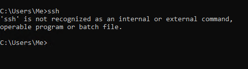

# BB-Pen-1
There is a server running at `45.79.118.12` (or kali.boysbrigade.au).  
You can connect using the following username: `gituser`  
Somewhere in this repository is the password to the user `gituser`.

## Challenge 1 (Super Easy)
Once you log in, you will find a file called `flag.txt` in the home directory.  
This file contains the flag (proof you finished) for this challenge.  
After you find the flag, DM it to me on Discord or email it to me.

## Challenge 2 (Still Super Easy)
There is another flag hidden somewhere in the same directory.

## Challenge 3 (More Difficult)
There are many more flags hidden around the server.  
Whoever finds the most flags will win a prize next week.  
Submit your flags to me by DM on Discord or email.  
Or you can just tell me in person on Friday.

### Hints
- After you find the password, you can use `ssh` to log in to the server.
  - The command is `ssh <user>@<ip\domain>`.
  - You will be prompted about the authenticity of the host. Type `yes` and press enter. (This is used to make sure you are connecting to the right server)
  - You will be prompted for the password. You can type it or paste it by right clicking.
- Here are some useful commands to know
  - `ls` - List files in the current directory
  - `cat <file>` - Print the contents of a file
  - `pwd` - Print the current working directory
  - `cd <directory>` - Change directory (disabled for you atm)
  - `help` or `man` - Get help about a command (some commands need one or the other)
  - `su` - Switch user Eg. `su gituser` (you will be prompted for the password)
  - `logout` - Log out of the server (also `Ctrl+D`)

### Without SSH
If you don't have SSH you will be shown this message when you try to connect:  
  
If this happens for you, you can use https://ssh.boysbrigade.au to connect to the server over the web.  
Use username `BB` and the same password as you would to SSH.